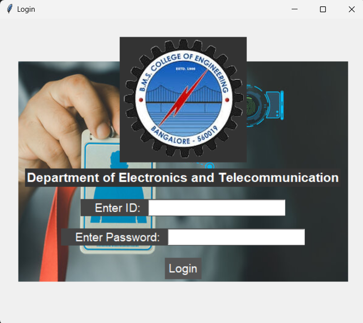

# Automated Attendance System using Facial Recognition 📸

Welcome to our Automated Attendance System! This project uses facial recognition to streamline attendance tracking. Say goodbye to manual roll calls and hello to efficient, real-time updates! 🚀



## 📚 Table of Contents
- [Overview](#overview)
- [Features](#features)
- [Setup](#setup)
- [Usage](#usage)
- [Results](#results)
- [Future Scope](#future-scope)
- [Contributors](#contributors)
- [License](#license)

## Overview

Our project leverages **OpenCV** and **Google Sheets API** to create a seamless attendance system. Designed to save time and ensure accuracy, it integrates real-time updates with reliable local logs.

## Features ✨
- **Facial Recognition**: Detect and recognize faces using OpenCV.
- **Real-time Updates**: Automatically update Google Sheets with attendance data.
- **Local Logs**: Maintain a backup of attendance records locally.
- **User-Friendly Interface**: Easy-to-use interface for smooth interaction.

## Setup 🛠️

1. **Clone the repo**:
   ```bash
   git clone https://github.com/your-repo-url.git

2. **Install Dependencies**

   ```bash
   pip install -r requirements.txt

3. **Set Up Google Sheets API**

   Follow [this guide](https://developers.google.com/sheets/api/quickstart/python) to set up your Google Sheets API and download `credentials.json`.

4. **Run the App**

   ```bash
   Login_Window.py

## Results📊

- **Accuracy:** High accuracy in facial recognition.
- **Efficiency:** Significant reduction in time taken for attendance.
- **Reliability:** Robust local and cloud data management.

## Future Scope🚀

- **Enhanced Object Detection:** Improve detection and localization capabilities.
- **Biometric Integration:** Add fingerprint and voice recognition.
- **Augmented Reality (AR):** Incorporate AR for better interaction.
- **Emotion Recognition:** Detect and analyze facial expressions.

## Contributors✨

- **[Navneet Ujjain](https://www.linkedin.com/in/navneetujjain/)**
- **[Aayushi Verma](https://www.linkedin.com/in/aayushi-verma-151838240/)**


